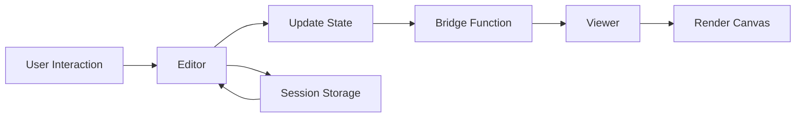

b5 is a React-based visual programming environment that uses a node-based interface for creative coding. This guide explains the project's architecture and how different components work together.

## High-Level Overview

The application follows a component-based architecture with clear separation between the editor interface and the viewer/renderer:

```
App.js (Root)
├── Editor (Visual Programming Interface)
│   ├── Playground (Main code canvas)
│   ├── Factory (Custom block definitions)
│   └── BlockSearch (Block discovery)
└── Viewer (Live preview canvas)
```

## Project Structure

The source code is organized in `/src` with the following structure:

```
src/
├── App.js                 # Root component, bridges Editor and Viewer
├── index.js              # Application entry point
├── serviceWorker.js      # PWA service worker
│
├── components/           # React components
│   ├── editor/          # Main editor component and logic
│   ├── viewer/          # Canvas viewer and rendering
│   ├── playground/      # Main code canvas (runs at 60 FPS)
│   ├── factory/         # Custom block creation (variables, functions, objects)
│   ├── blockRenderer/   # Block rendering and display logic
│   ├── blockSearch/     # Block search and discovery
│   ├── codeCanvas/      # Code canvas grid and layout
│   ├── codeBlocks/      # Block management
│   ├── blockPreview/    # Block preview components
│   ├── headers/         # Top navigation and headers
│   └── hint/           # Tooltip and documentation hints
│
├── b5.js/               # Submodule: Core rendering engine
├── q5xjs/              # Optimized canvas renderer
│
├── css/                # Stylesheets
├── postcss/            # PostCSS source files
├── img/                # Images and assets
│   ├── logo/          # Brand assets
│   ├── icons/         # UI icons
│   ├── components/    # Component-specific images
│   └── toolbarIcons/  # Toolbar icons
│
├── examples/           # Example b5 projects
└── __test__/          # Test files
```

## Core Components

### App.js

The root component manages state and data flow between Editor and Viewer:

```javascript
function App() {
  const [data, setData] = useState({})

  const bridgeData = data => {
    // Send data from Editor to Viewer
    setData(data)
  }

  return (
    <>
      <Editor bridge={bridgeData} />
      <Viewer key="b5-viewer" data={data} />
    </>
  )
}
```

See `src/App.js:1`

### Editor Component

The main programming environment where users create visual programs. Key responsibilities:

- Managing editor state (blocks, wires, sections)
- Handling user interactions (drag, click, search)
- Coordinating Playground and Factory sections
- Session storage for persistence

Location: `src/components/editor/editor.js:1`

The editor state structure:

```javascript
{
  playground: {
    type: 'playground',
    lineStyle: {},
    blocks: {},
  },
  factory: {
    variable: [],
    function: [],
    object: [],
  }
}
```

### Playground vs Factory

<CodeGroup>
```javascript Playground
// Main code canvas
// Runs 60 times per second (like p5.js draw())
// Sequential execution: left to right, top to bottom
// Contains the active program logic
```

```javascript Factory
// Custom block definitions
// Runs once before Playground starts (like p5.js setup())
// Define variables, functions, and objects
// Blocks can be dragged into Playground
```
</CodeGroup>

### Viewer Component

Renders the live preview of the visual program:

- Receives data from Editor via bridge
- Displays canvas output
- Controls for pause/play, refresh, capture
- Minimizable to corner

Location: `src/components/viewer/viewer.js:1`

### Block Rendering System

The block rendering system handles the visual representation of code blocks:

- **blockRenderer/** - Main block rendering logic
- **blockRendererLite.js** - Lightweight block renderer
- **node.js** - Input/output node rendering
- **wireRenderer.js** - Connection wire rendering
- **specialBlocks/** - Special block types:
  - Color picker
  - Input fields
  - Sliders
  - Comments
  - Inline blocks

Location: `src/components/blockRenderer/`

### Block Search

Fuzzy search system for discovering and adding blocks:

- Uses Fuse.js for fuzzy searching
- Searches by name, type, or description
- Activated by double-clicking empty block spaces

Location: `src/components/blockSearch/`

## b5.js Submodule

<Warning>
  b5.js is a **git submodule** and must be cloned separately. It's the core rendering engine that executes the visual programs.
</Warning>

The b5.js submodule (`src/b5.js/`) is a separate library that:

- Interprets and executes block-based programs
- Converts blocks/wires to executable code
- Will eventually run standalone to execute b5 JSON files on other websites

Repository: [github.com/peilingjiang/b5.js](https://github.com/peilingjiang/b5.js)

## Data Flow



1. **User Input**: User interacts with Editor (drag blocks, create wires)
2. **State Update**: Editor updates internal state
3. **Bridge**: Editor sends data to Viewer via bridge function
4. **Rendering**: Viewer receives data and updates canvas
5. **Persistence**: Editor state saved to session storage

## Execution Model

### Sequential Execution

<Note>
  Unlike most node-based visual programming languages (e.g., Grasshopper, Max), b5 executes blocks **sequentially** based on grid position.
</Note>

Execution order:
1. **Factory** sections run once (like p5.js `setup()`)
2. **Playground** runs 60 times per second (like p5.js `draw()`)
3. Within Playground: **left to right, top to bottom** (line by line)

### Effect Blocks

Special blocks that affect subsequent blocks through context rather than wire connections:

- Similar to p5.js functions like `fill()`, `stroke()`, `scale()`
- Affect blocks based on positional relationships
- Visual feedback shows effective range when selected

Examples: fill color, stroke color, transformation matrices

## Key Technologies

- **React 18** - UI framework
- **React Hooks** - State management (`useHooks.js`)
- **Fuse.js** - Fuzzy search for blocks
- **React Color** - Color picker component
- **file-saver** - Export/save functionality
- **uuid** - Unique identifiers for blocks
- **PostCSS** - CSS processing with plugins
- **Bun** - JavaScript runtime and package manager

## File Persistence

Current implementation:

- **Session Storage**: Automatic save of editor state
- **JSON Export**: Save projects as JSON files (`Cmd/Ctrl + S`)
- **JSON Import**: Drag JSON files into editor to load

Future: Cloud storage and sharing features

## Testing

Test files located in `src/__test__/`:

- Component tests using React Testing Library
- Jest as test runner
- Run with: `bun run test`

Location: `src/__test__/components/editor/editor.test.js`

## Build Process

### Development

```bash
# CSS compilation (PostCSS)
bun run css

# React development server
bun start
```

### Production

```bash
# Full deployment build
bun run deploy
```

This runs:
1. Gulp tasks for CSS optimization
2. React production build
3. Output to `build/` directory

## Constants and Configuration

Shared constants defined in `src/components/constants.js`:

- `lineNumberWidth` - Grid line number width
- `blockAlphabetHeight` - Block height
- `gap` - Spacing between blocks

Default editor configurations in `src/components/editor/defaultValue.js`

## Next Steps

- Review the [Contributing Guide](/community/contributing) to start contributing
- Check out the [Development Setup](/community/development-setup) for environment setup
- Read the example files in `src/examples/` to understand b5 project structure
